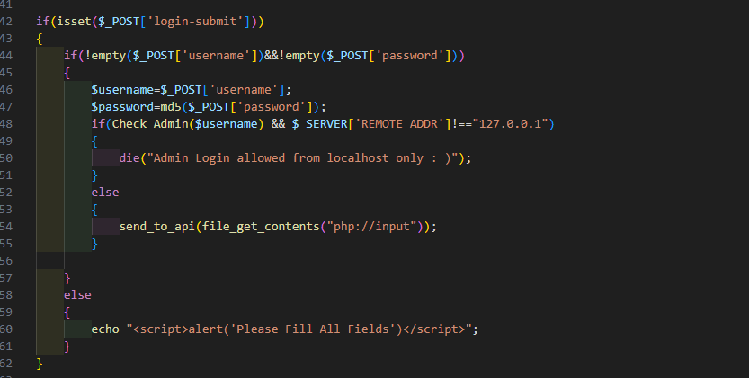
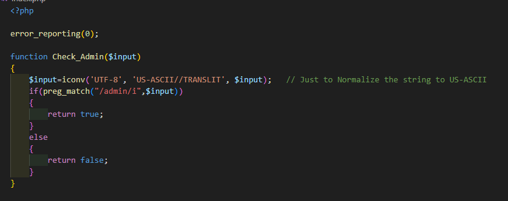
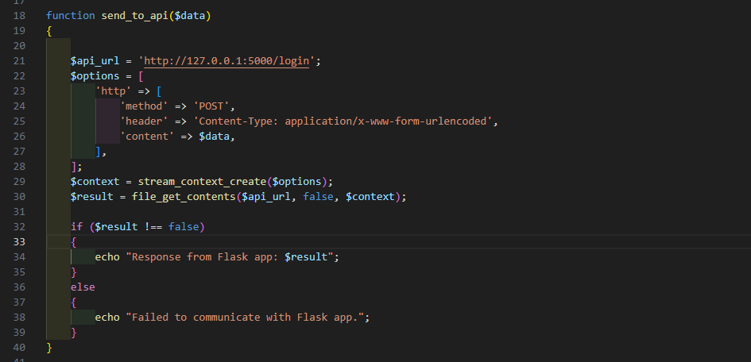
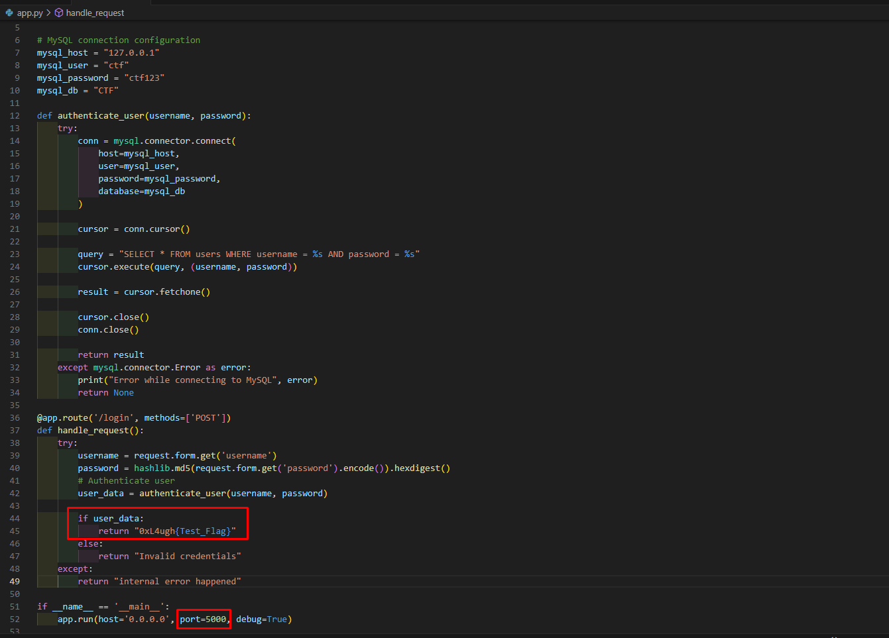
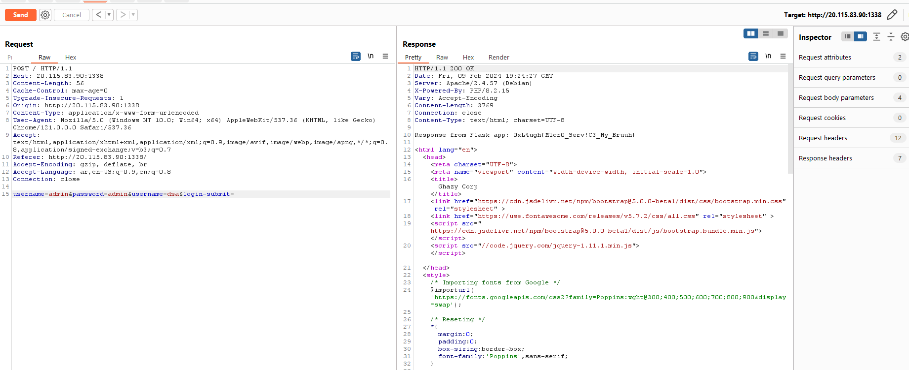

## Micro web challenge writeup

Micro is an ez code review web challenge that had 2 files:

- app.py
- index.php 

With this description:

```ini
Remember Bruh 1,2 ? This is bruh 3 : D  
login with admin:admin and you will get the flag  :*

> Author : abdoghazy

[Link](http://20.115.83.90:1338 )
```


#### index.php analysis:

#### Login Function



- Just a simple login function that takes the username and hash the password then pass the username to `Check_Admin` function.
- If the `Check_Admin` function returned True and the ip address wasn't the localhost the page  execution will die and print "Admin Login allowed from localhost only : )"
- If the previous condition fail, it will pass the POST data to `send_to_api` function.


#### Check_Admin function



- Normalizing string to prevent default normalization in mysql.
- Checking if the normalized string had `admin` value case insensitive.
- If the previous condition matched the input it will return true otherwise it will return false.


#### send_to_api function



- Takes the data and send it to the internal API that running locally at port 5000 .


#### app.py analysis:

#### 

- Normal flask login function that checks if the `username` and `password` are existed in the users table.
- If the user existed the application will return the flag.


#### Solution :

The solution must be clear now, the player must bypass `Check_Admin`  function to pass the `admin:admin` creds to the internal API and get the flag.

the bug here is the way how Flask and Php will handle the parameters if there is more than one parameter with the same name 

like :  parameter1=value1&parameter1=value2&parameter1=value3

php will take the last one and flask will take the first one 

parameter1 in php -> value3

parameter1 in flask -> value1


So, if we passed : username=admin&username=safe&password=admin&login-submit=

the php will take the last username so, the value will be "safe" and then `Check_Admin` function will not be triggered so, the post data will be forwarded to the internal API.


