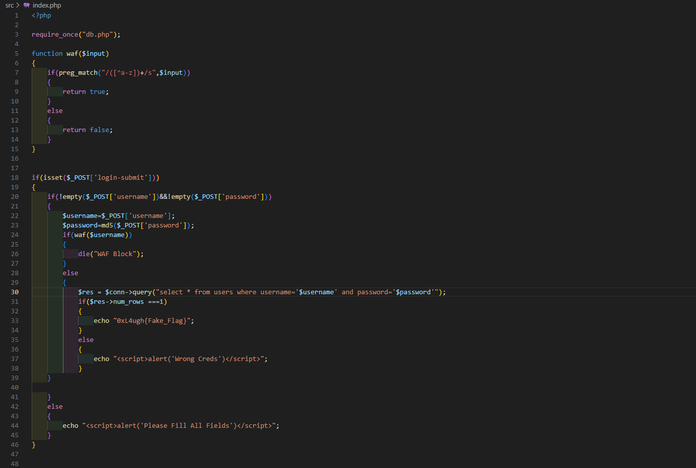

## Simple WAF web challenge quick writeup

Simple WAF is a medium code review web challenge that had 2 files:

- index.php
- db.php

With this description:

```ini
i whitelisted input values so, i think iam safe : P

> Author : abdoghazy

[Link](http://20.115.83.90:1339/)
```


#### index.php analysis:



- Just a simple login function that takes the username and hash the password then pass the username to `waf` function returned true, the page execution will die and print "WAF Block".
- If the waf function returned false the application will pass our parameters directly to the query without any sanitization which make it vulnerable to SQL injection.
- If the login SQL query returned value, the application will return the flag.


#### waf function


- Using `preg_match` function to match any values with the regex `/([^a-z])+/s`.
- this regex will match anything except : `a-z` for one or more times.


#### Solution :

The solution must be clear now, the player must bypass `waf` function to do SQL injection and make the query return data and get the flag.

The bug here is in the return value of the `preg_match` php function.

`preg_match` and `preg_replace` functions called PCRE functions and based on the php documentation 

it will return 1 if match and 0 if not and FALSE on failure.

 

So, if we can make preg_match() fail it will return false and our input will be passed directly to the sql query.

our Regex is vulnerable to Redos. it checks the pattern recursively one or (more).

Do you ever think if this (more) had a limit or not ?  : D

yes, pcre php functions hard a limit by default. if you run phpinfo() you will get it.


so basically, we can send alot of any matching characters to make the preg_match function fail and put our payload.

```python
python3 -c "print(__import__('requests').post('http://20.115.83.90:1339/',data={'username':'_'*9000+'\'||1#','passwo
rd':'test','login-submit':''}).text)"|head

```


https://github.com/mybb/mybb/security/advisories/GHSA-pr74-wvp3-q6f5

 CVE-2023-41362


#### The secure way will be like this : 

```php
if(preg_match("/([^a-z])+/s",$input) !==0)
{
    return true;
}
else
{
    return false;
}
```

