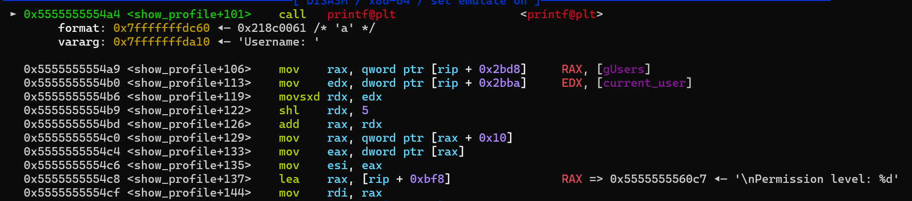
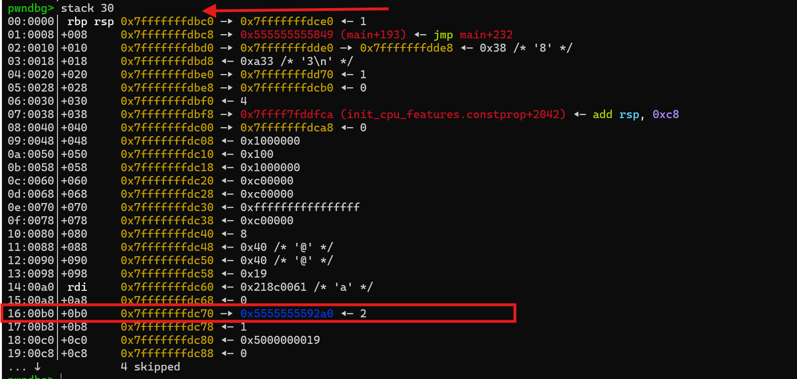
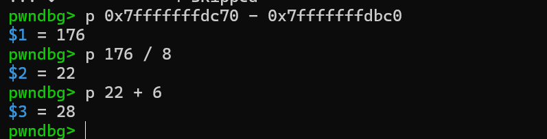
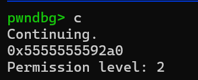
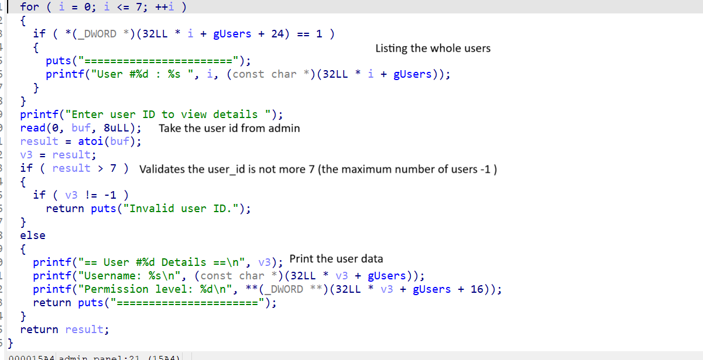

### Challenge Overview

This challenge is a sequel to the "Elbareed Elmasry" challenge, featuring similar concepts with added complexity. The application includes basic functionalities such as **Register**, **Login**, **View Profile**, and **Admin Panel**. 

The goal is to exploit a short-length format string vulnerability to escalate permissions to `5`, granting access to the admin panel. Once inside, an out-of-bounds (OOB) read vulnerability in the admin panel can be leveraged to leak the flag from memory.

All standard protections are enabled in this challenge.

---

### Solution Steps

#### 1. **Calculating the Permissions Index**

- Register a user with any username, log in, and set a breakpoint at the vulnerable `printf` function.
- Print the stack and calculate the offset between the top of the stack (`rsp`) and the permissions pointer. Divide the result by `8` (address size) and add `6` (the index of `printf` parameters). This gives the exact index of the permissions pointer: `28`.

    Formula:  
    `(Permissions address - Top of stack (rsp)) / 8 + 6 = 28`

- To verify, leak the value at `%28$p`. This should reveal the heap address pointing to the permissions.

    Example Output:  
      
      
      
    

#### 2. **Overriding Permissions**

- Use the format specifier `%n` to overwrite the permissions pointer. For example:  
  `AAA%28$n` writes `3` to the pointer at index `28` (as "AAA" is 3 characters long).

- To set permissions to `5`, craft the payload accordingly:  
  `AAAAA%28$n`.

- After sending the payload, re-login with the same account and access the admin panel.

#### 3. **Exploiting the OOB Read to Leak the Flag**

- Once admin access is obtained, the flag is loaded into memory.
- The admin panel allows entering a `user_id`, which is used as an index to retrieve user data from the list. However, the application only checks if the index is greater than `7` and does not validate lower bounds.

- By entering negative indices (e.g., `-1`, `-2`, `-3`), you can read data from the stack. The flag is located at index `-10`.

    Example Output:  
    

---

### Final Exploit Steps

1. Register and log in with the username: `"a"`.
2. Register and log in with the username: `"AAAAA%28$n"` to overwrite the first user's permissions.
3. Re-login with the username: `"a"`.
4. Access the admin panel.
5. Use the OOB read vulnerability to leak the flag from the stack.

For the full exploit, refer to the [exploit script](./solve.py).
