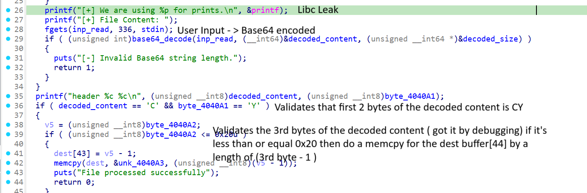

### Brief

This is an easy Pwn challenge where the application performs some checks on the command-line arguments (`argv`). <br>
If the user passes three arguments, the application crashes due to a bug in the code. <br>
If the user passes two arguments, the application prints a leak of the `printf` function's address (a libc leak) and requests a Base64-encoded file content for decoding / parsing.<br> The challenge contains an easy buffer overflow (BOF) vulnerability caused by an integer overflow in the size of the `memcpy` operation.<br> Exploiting this BOF allows for a classic `ret2libc` attack.

---

### Program Flow



1. Prints the address of the `printf` function.
2. Accepts up to 336 bytes of user input and validates if its length is divisible by 4 (`inp % 4 == 0`).
3. Decodes the input using Base64 and validates that the first two bytes of the decoded content are equal to `"CY"`.
4. Checks if the third byte of the decoded content is less than or equal to `0x20` (We knew that this check is for the 3rd byte by debugging).
5. Copies data from the decoded input to a `buffer[44]` using `memcpy`, with the length determined by the value of the third byte.

---

### Solution Approaches


1. **Leaking the libc Address**

    Use the leaked `printf` address to calculate the base address of libc:

    ```py
    libc = ELF("./libc.so.6")
    libc.address = printf_leak - libc.symbols["printf"]
    ```
    
    You can verify this address by attaching a debugger (e.g., GDB) to the process.

2. **Exploiting the Buffer Overflow**

    The third byte of the decoded input is treated as an `unsigned __int8`, meaning its value ranges from 0 to 255. However, since `memcpy` uses `(3rd_byte - 1)` as the length, passing a value of `0` causes an integer underflow, resulting in a length of `255`.<br> This allows you to overflow the stack, control the return instruction pointer (RIP), and hijack the program's execution flow. The prefix of the payload should be `"CY\0"`.

---

### Constructing the Payload

With control over the RIP, you can construct a ROP chain to execute `system("/bin/sh")`. The payload structure is as follows:

1. Prefix: `"CY\0"`.
2. Padding: `"A" * 56` (to fill the buffer and overwrite the saved base pointer).
3. ROP gadgets:
    - A gadget to control the `rdi` register (first argument to `system`).
    - The address of `"/bin/sh\0"` in libc.
    - The address of a `ret` instruction (for stack alignment before the system call).
    - The address of the `system` function.

By combining these components, you can achieve arbitrary code execution and spawn a shell.
