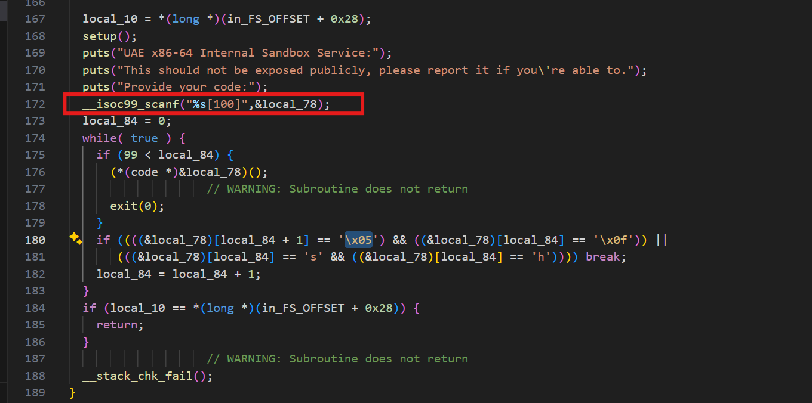

This is an easy Pwn challenge where the program asks for a code, places it on the stack (which is executable due to the missing NX bit), and then executes it.

Essentially, this is a shellcode injection challenge. However, there are some restrictions because the program validates the shellcode against the following bytes:

1. `\x0F` and `\x05` (the byte equivalents of the `syscall` instruction, which is essential for interacting with the operating system).
2. The characters `s` and `h` (part of `/bin/sh` or `bash`).

### Solution Approaches

> **Note:** I used the [Dogbolt](https://dogbolt.org/) website to analyze the binary since IDA Free failed to decompile it effectively.

There are two methods to solve this challenge:

1. **Using a Shellcode Encoder**  
    To bypass the bad characters, you can use a shellcode encoder (as demonstrated in my solution script: [solve.py](./solve.py)).  
    I utilized the shellcode encoder from the `pwntools` library to achieve this.

2. **Exploiting a Validation Bug**  
    The program contains a mistake that allows bypassing the validation. The application only checks the first 100 characters of the input, but you can insert any payload beyond this limit without restrictions.  
    This issue arises due to a syntax error in the `scanf` function.  

    

    It seems the author intended to limit `scanf` to the first 100 characters, but the syntax error caused this restriction to fail. As a result, you can use the first 100 characters as NOPs and safely place your shellcode afterward.

    > **Note:** The solver may need to be executed multiple times to work, and the reason for this behavior is unclear for me. 😄