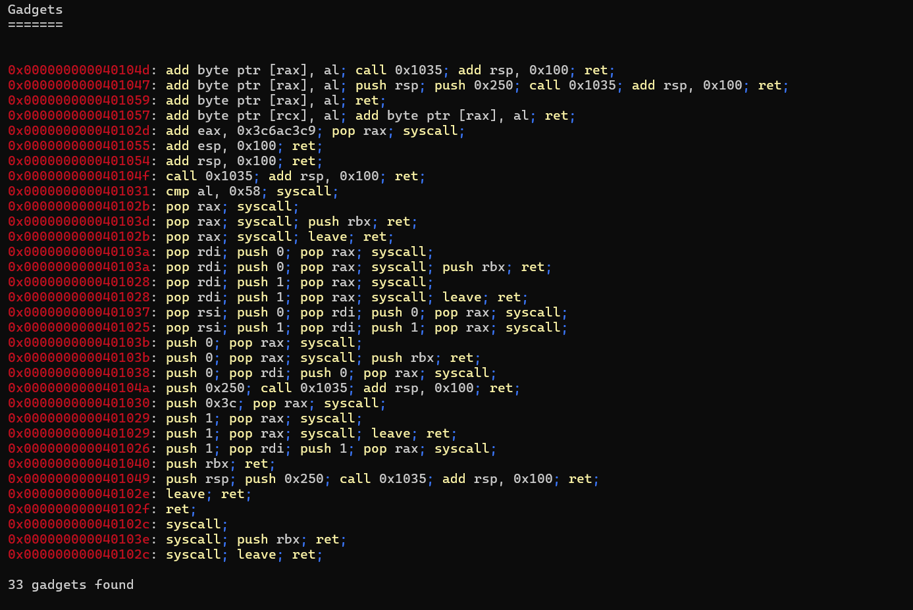
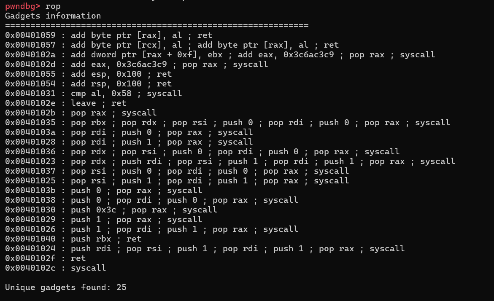
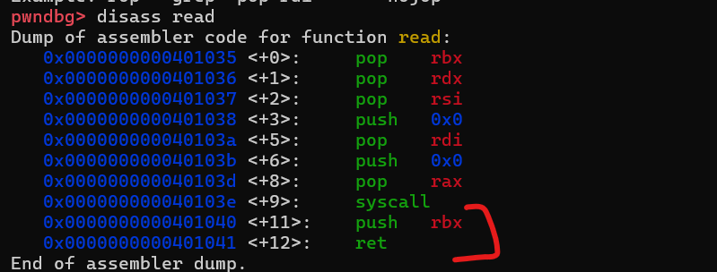

This is a medium Pwn challenge where the program is vulnerable to a classic buffer overflow (BOF). It accepts up to 0x250 characters as input but stores them in a buffer of size 0x100.

The binary has no PIE or Canary, and since there is no `win` function or a leak to libc, and the stack is not executable, this is a Return-Oriented Programming (ROP) challenge.

---

### Solution Approaches

#### **1. ROP (Failed Attempt)**  
Initially, I attempted to solve this as a classic ROP challenge. The goal was to set the following registers for the `execve` syscall:

- `RAX = 59` (syscall number for `execve`)
- `RDI = pointer to "/bin/sh\0"` (first argument)
- `RSI = 0` (second argument)
- `RDX = 0` (third argument)

After setting these registers, the plan was to jump to the `syscall` instruction to spawn a shell. However, I couldn't find enough gadgets to complete the ROP chain.

**Gadgets Found:**

- From `ropper`:
    
- From `Ropgadget`:
    

Due to the lack of sufficient gadgets, I moved on to the next approach.

---

#### **2. SROP (Successful Attempt)**  
The binary contains useful gadgets to call `read`/`write` syscalls and a gadget for `syscall` itself. This led me to explore Sigreturn-Oriented Programming (SROP).

Since I was unfamiliar with SROP, I referred to an explanation in Arabic with examples:  
[GPT Explanation on ROP and SROP](https://chatgpt.com/share/68135199-5594-8005-963c-ec87cd045e8c).

By applying the example, I successfully triggered a `syscall` to `execve`. However, I faced an issue: I didn't have an address for my input to set `RDI` (the first argument to `execve`).  

**Solution Insight:**  
I noticed that the `banner` variable in the `.data` section had a static address (due to the absence of PIE). I decided to overwrite the first 8 bytes of `banner` with "/bin/sh\0" using the `read` syscall and use it's address at execve later.

---

### Final Solution Steps

1. **Overflow the Buffer:**  
     Fill the stack with junk until reaching the return address (offset: 256 bytes).

2. **Trigger `read` Syscall:**  
     Use the following gadget to call `read`:
     ```
     0x401035 : pop rbx ; pop rdx ; pop rsi ; push 0 ; pop rdi ; push 0 ; pop rax ; syscall
     ```
     - Set the following values:
         - `RBX`: Return address (set to the `syscall` gadget)
         - `RDX`: Address of the `banner` buffer
         - `RSI`: Number of bytes to read
         - `RAX`: 0 (syscall number for `read`)

     This will execute:  
     `read(0, banner_address, 10)`  
     (Note: x64 calling convention: `func(RDI, RSI, RDX, RCX, ...)`)

3. **Overwrite `banner`:**  
     Send "/bin/sh\0" via `stdin` to overwrite the first 8 bytes of `banner`.

4. **Return to `syscall`:**  
     After `read` completes, it returns to the address in `RBX` (set to the `syscall` gadget).

     

5. **Trigger `rt_sigreturn`:**  
     The `syscall` gadget will be executed with `RAX = 15` (syscall number for `rt_sigreturn`), returning control to a fake signal frame.

6. **Craft Fake Signal Frame:**  
     Use `pwntools` to create a fake signal frame that sets the following registers:
     - `RAX = 59` (syscall number for `execve`)
     - `RDI = banner_address` (address of "/bin/sh\0")
     - `RSI = 0`
     - `RDX = 0`

7. **Execute `execve`:**  
     The fake signal frame triggers the `execve` syscall, spawning a shell.

For implementation details, refer to [solve.py](./solve.py).
